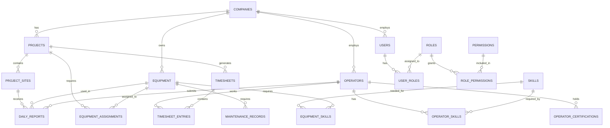

# Database Design

## Overview

The Bitcorp ERP database is designed using PostgreSQL to support civil engineering equipment management with a focus on scalability, performance, and data integrity. The design emphasizes clear relationships, efficient querying, and support for real-time operations.

## Entity Relationship Diagram



## Core Tables

### Companies Table
```sql
CREATE TABLE companies (
    id SERIAL PRIMARY KEY,
    name VARCHAR(255) NOT NULL,
    tax_id VARCHAR(50) UNIQUE,
    address TEXT,
    phone VARCHAR(20),
    email VARCHAR(255),
    website VARCHAR(255),
    settings JSONB DEFAULT '{}',
    is_active BOOLEAN DEFAULT true,
    created_at TIMESTAMP WITH TIME ZONE DEFAULT CURRENT_TIMESTAMP,
    updated_at TIMESTAMP WITH TIME ZONE DEFAULT CURRENT_TIMESTAMP
);
```

### Users Table
```sql
CREATE TABLE users (
    id SERIAL PRIMARY KEY,
    company_id INTEGER REFERENCES companies(id) ON DELETE CASCADE,
    email VARCHAR(255) UNIQUE NOT NULL,
    password_hash VARCHAR(255) NOT NULL,
    first_name VARCHAR(100) NOT NULL,
    last_name VARCHAR(100) NOT NULL,
    phone VARCHAR(20),
    avatar_url VARCHAR(500),
    is_active BOOLEAN DEFAULT true,
    last_login TIMESTAMP WITH TIME ZONE,
    email_verified_at TIMESTAMP WITH TIME ZONE,
    created_at TIMESTAMP WITH TIME ZONE DEFAULT CURRENT_TIMESTAMP,
    updated_at TIMESTAMP WITH TIME ZONE DEFAULT CURRENT_TIMESTAMP
);
```

### Equipment Table
```sql
CREATE TABLE equipment (
    id SERIAL PRIMARY KEY,
    company_id INTEGER REFERENCES companies(id) ON DELETE CASCADE,
    name VARCHAR(255) NOT NULL,
    model VARCHAR(255),
    brand VARCHAR(255),
    serial_number VARCHAR(100) UNIQUE,
    equipment_type VARCHAR(100) NOT NULL,
    year_manufactured INTEGER,
    purchase_date DATE,
    purchase_cost DECIMAL(12,2),
    current_value DECIMAL(12,2),
    hourly_rate DECIMAL(8,2),
    fuel_type VARCHAR(50),
    fuel_capacity DECIMAL(8,2),
    current_location POINT,
    current_site_id INTEGER REFERENCES project_sites(id),
    status VARCHAR(50) DEFAULT 'available', -- available, in_use, maintenance, retired
    last_maintenance DATE,
    next_maintenance DATE,
    hourmeter_reading INTEGER DEFAULT 0,
    odometer_reading INTEGER DEFAULT 0,
    specifications JSONB DEFAULT '{}',
    images JSONB DEFAULT '[]',
    notes TEXT,
    is_active BOOLEAN DEFAULT true,
    created_at TIMESTAMP WITH TIME ZONE DEFAULT CURRENT_TIMESTAMP,
    updated_at TIMESTAMP WITH TIME ZONE DEFAULT CURRENT_TIMESTAMP
);
```

### Operators Table
```sql
CREATE TABLE operators (
    id SERIAL PRIMARY KEY,
    company_id INTEGER REFERENCES companies(id) ON DELETE CASCADE,
    user_id INTEGER REFERENCES users(id) ON DELETE SET NULL,
    employee_id VARCHAR(50),
    first_name VARCHAR(100) NOT NULL,
    last_name VARCHAR(100) NOT NULL,
    phone VARCHAR(20),
    email VARCHAR(255),
    hire_date DATE,
    base_hourly_rate DECIMAL(8,2),
    status VARCHAR(50) DEFAULT 'active', -- active, inactive, suspended
    emergency_contact_name VARCHAR(255),
    emergency_contact_phone VARCHAR(20),
    address TEXT,
    license_number VARCHAR(100),
    license_expiry DATE,
    medical_cert_expiry DATE,
    performance_rating DECIMAL(3,2) DEFAULT 0.0,
    total_hours_worked INTEGER DEFAULT 0,
    notes TEXT,
    avatar_url VARCHAR(500),
    is_active BOOLEAN DEFAULT true,
    created_at TIMESTAMP WITH TIME ZONE DEFAULT CURRENT_TIMESTAMP,
    updated_at TIMESTAMP WITH TIME ZONE DEFAULT CURRENT_TIMESTAMP
);
```

### Projects Table
```sql
CREATE TABLE projects (
    id SERIAL PRIMARY KEY,
    company_id INTEGER REFERENCES companies(id) ON DELETE CASCADE,
    name VARCHAR(255) NOT NULL,
    description TEXT,
    project_code VARCHAR(50) UNIQUE,
    client_name VARCHAR(255),
    client_contact VARCHAR(255),
    start_date DATE,
    end_date DATE,
    estimated_budget DECIMAL(15,2),
    actual_cost DECIMAL(15,2) DEFAULT 0.0,
    status VARCHAR(50) DEFAULT 'planning', -- planning, active, on_hold, completed, cancelled
    priority VARCHAR(20) DEFAULT 'medium', -- low, medium, high, urgent
    project_manager_id INTEGER REFERENCES users(id),
    location POINT,
    address TEXT,
    specifications JSONB DEFAULT '{}',
    documents JSONB DEFAULT '[]',
    notes TEXT,
    is_active BOOLEAN DEFAULT true,
    created_at TIMESTAMP WITH TIME ZONE DEFAULT CURRENT_TIMESTAMP,
    updated_at TIMESTAMP WITH TIME ZONE DEFAULT CURRENT_TIMESTAMP
);
```

### Project Sites Table
```sql
CREATE TABLE project_sites (
    id SERIAL PRIMARY KEY,
    project_id INTEGER REFERENCES projects(id) ON DELETE CASCADE,
    name VARCHAR(255) NOT NULL,
    description TEXT,
    location POINT,
    address TEXT,
    site_supervisor_id INTEGER REFERENCES users(id),
    status VARCHAR(50) DEFAULT 'inactive', -- inactive, active, completed
    start_date DATE,
    end_date DATE,
    specifications JSONB DEFAULT '{}',
    safety_requirements TEXT,
    access_instructions TEXT,
    is_active BOOLEAN DEFAULT true,
    created_at TIMESTAMP WITH TIME ZONE DEFAULT CURRENT_TIMESTAMP,
    updated_at TIMESTAMP WITH TIME ZONE DEFAULT CURRENT_TIMESTAMP
);
```

## Skills and Certifications

### Skills Table
```sql
CREATE TABLE skills (
    id SERIAL PRIMARY KEY,
    name VARCHAR(255) UNIQUE NOT NULL,
    description TEXT,
    category VARCHAR(100), -- equipment_operation, safety, technical
    level VARCHAR(50), -- basic, intermediate, advanced, expert
    requires_certification BOOLEAN DEFAULT false,
    certification_valid_months INTEGER,
    is_active BOOLEAN DEFAULT true,
    created_at TIMESTAMP WITH TIME ZONE DEFAULT CURRENT_TIMESTAMP
);
```

### Operator Skills Table
```sql
CREATE TABLE operator_skills (
    id SERIAL PRIMARY KEY,
    operator_id INTEGER REFERENCES operators(id) ON DELETE CASCADE,
    skill_id INTEGER REFERENCES skills(id) ON DELETE CASCADE,
    proficiency_level VARCHAR(50), -- basic, intermediate, advanced, expert
    certified_date DATE,
    certification_expiry DATE,
    certifying_authority VARCHAR(255),
    certificate_number VARCHAR(100),
    is_verified BOOLEAN DEFAULT false,
    notes TEXT,
    created_at TIMESTAMP WITH TIME ZONE DEFAULT CURRENT_TIMESTAMP,
    updated_at TIMESTAMP WITH TIME ZONE DEFAULT CURRENT_TIMESTAMP,
    UNIQUE(operator_id, skill_id)
);
```

### Equipment Skills Table
```sql
CREATE TABLE equipment_skills (
    id SERIAL PRIMARY KEY,
    equipment_id INTEGER REFERENCES equipment(id) ON DELETE CASCADE,
    skill_id INTEGER REFERENCES skills(id) ON DELETE CASCADE,
    required_level VARCHAR(50), -- basic, intermediate, advanced, expert
    is_mandatory BOOLEAN DEFAULT true,
    created_at TIMESTAMP WITH TIME ZONE DEFAULT CURRENT_TIMESTAMP,
    UNIQUE(equipment_id, skill_id)
);
```

## Scheduling and Time Tracking

### Timesheets Table
```sql
CREATE TABLE timesheets (
    id SERIAL PRIMARY KEY,
    project_id INTEGER REFERENCES projects(id) ON DELETE CASCADE,
    site_id INTEGER REFERENCES project_sites(id) ON DELETE CASCADE,
    created_by INTEGER REFERENCES users(id),
    approved_by INTEGER REFERENCES users(id),
    week_start_date DATE NOT NULL,
    week_end_date DATE NOT NULL,
    status VARCHAR(50) DEFAULT 'draft', -- draft, submitted, approved, rejected
    total_hours DECIMAL(8,2) DEFAULT 0.0,
    total_cost DECIMAL(12,2) DEFAULT 0.0,
    notes TEXT,
    submitted_at TIMESTAMP WITH TIME ZONE,
    approved_at TIMESTAMP WITH TIME ZONE,
    created_at TIMESTAMP WITH TIME ZONE DEFAULT CURRENT_TIMESTAMP,
    updated_at TIMESTAMP WITH TIME ZONE DEFAULT CURRENT_TIMESTAMP
);
```

### Timesheet Entries Table
```sql
CREATE TABLE timesheet_entries (
    id SERIAL PRIMARY KEY,
    timesheet_id INTEGER REFERENCES timesheets(id) ON DELETE CASCADE,
    operator_id INTEGER REFERENCES operators(id) ON DELETE CASCADE,
    equipment_id INTEGER REFERENCES equipment(id) ON DELETE CASCADE,
    work_date DATE NOT NULL,
    start_time TIME,
    end_time TIME,
    hours_worked DECIMAL(5,2),
    hourly_rate DECIMAL(8,2),
    total_cost DECIMAL(10,2),
    overtime_hours DECIMAL(5,2) DEFAULT 0.0,
    overtime_rate DECIMAL(8,2),
    status VARCHAR(50) DEFAULT 'scheduled', -- scheduled, completed, cancelled, no_show
    task_description TEXT,
    notes TEXT,
    created_at TIMESTAMP WITH TIME ZONE DEFAULT CURRENT_TIMESTAMP,
    updated_at TIMESTAMP WITH TIME ZONE DEFAULT CURRENT_TIMESTAMP
);
```

### Equipment Assignments Table
```sql
CREATE TABLE equipment_assignments (
    id SERIAL PRIMARY KEY,
    equipment_id INTEGER REFERENCES equipment(id) ON DELETE CASCADE,
    project_id INTEGER REFERENCES projects(id) ON DELETE CASCADE,
    site_id INTEGER REFERENCES project_sites(id) ON DELETE CASCADE,
    assigned_by INTEGER REFERENCES users(id),
    start_date DATE NOT NULL,
    end_date DATE,
    status VARCHAR(50) DEFAULT 'assigned', -- assigned, active, completed, cancelled
    hourly_rate DECIMAL(8,2),
    estimated_hours INTEGER,
    actual_hours INTEGER DEFAULT 0,
    notes TEXT,
    created_at TIMESTAMP WITH TIME ZONE DEFAULT CURRENT_TIMESTAMP,
    updated_at TIMESTAMP WITH TIME ZONE DEFAULT CURRENT_TIMESTAMP
);
```

## Daily Operations

### Daily Reports Table
```sql
CREATE TABLE daily_reports (
    id SERIAL PRIMARY KEY,
    operator_id INTEGER REFERENCES operators(id) ON DELETE CASCADE,
    equipment_id INTEGER REFERENCES equipment(id) ON DELETE CASCADE,
    site_id INTEGER REFERENCES project_sites(id) ON DELETE CASCADE,
    report_date DATE NOT NULL,
    start_time TIMESTAMP WITH TIME ZONE,
    end_time TIMESTAMP WITH TIME ZONE,
    hours_worked DECIMAL(5,2),
    start_hourmeter INTEGER,
    end_hourmeter INTEGER,
    hourmeter_hours INTEGER,
    start_odometer INTEGER,
    end_odometer INTEGER,
    distance_traveled INTEGER,
    fuel_start_level DECIMAL(5,2),
    fuel_end_level DECIMAL(5,2),
    fuel_consumed DECIMAL(5,2),
    fuel_added DECIMAL(5,2),
    start_location POINT,
    end_location POINT,
    work_description TEXT,
    weather_conditions VARCHAR(100),
    safety_incidents TEXT,
    maintenance_issues TEXT,
    status VARCHAR(50) DEFAULT 'submitted', -- submitted, validated, approved, rejected
    validated_by INTEGER REFERENCES users(id),
    validated_at TIMESTAMP WITH TIME ZONE,
    submission_method VARCHAR(50) DEFAULT 'mobile', -- mobile, web, manual
    photos JSONB DEFAULT '[]',
    notes TEXT,
    created_at TIMESTAMP WITH TIME ZONE DEFAULT CURRENT_TIMESTAMP,
    updated_at TIMESTAMP WITH TIME ZONE DEFAULT CURRENT_TIMESTAMP
);
```

### Maintenance Records Table
```sql
CREATE TABLE maintenance_records (
    id SERIAL PRIMARY KEY,
    equipment_id INTEGER REFERENCES equipment(id) ON DELETE CASCADE,
    maintenance_type VARCHAR(100) NOT NULL, -- preventive, corrective, emergency
    description TEXT NOT NULL,
    scheduled_date DATE,
    completed_date DATE,
    performed_by VARCHAR(255),
    vendor_name VARCHAR(255),
    cost DECIMAL(10,2),
    parts_used JSONB DEFAULT '[]',
    hours_down INTEGER DEFAULT 0,
    next_maintenance_date DATE,
    status VARCHAR(50) DEFAULT 'scheduled', -- scheduled, in_progress, completed, cancelled
    notes TEXT,
    documents JSONB DEFAULT '[]',
    created_at TIMESTAMP WITH TIME ZONE DEFAULT CURRENT_TIMESTAMP,
    updated_at TIMESTAMP WITH TIME ZONE DEFAULT CURRENT_TIMESTAMP
);
```

## Authorization and Permissions

### Roles Table
```sql
CREATE TABLE roles (
    id SERIAL PRIMARY KEY,
    name VARCHAR(100) UNIQUE NOT NULL,
    description TEXT,
    permissions JSONB DEFAULT '[]',
    is_system_role BOOLEAN DEFAULT false,
    is_active BOOLEAN DEFAULT true,
    created_at TIMESTAMP WITH TIME ZONE DEFAULT CURRENT_TIMESTAMP
);
```

### User Roles Table
```sql
CREATE TABLE user_roles (
    id SERIAL PRIMARY KEY,
    user_id INTEGER REFERENCES users(id) ON DELETE CASCADE,
    role_id INTEGER REFERENCES roles(id) ON DELETE CASCADE,
    assigned_by INTEGER REFERENCES users(id),
    assigned_at TIMESTAMP WITH TIME ZONE DEFAULT CURRENT_TIMESTAMP,
    expires_at TIMESTAMP WITH TIME ZONE,
    is_active BOOLEAN DEFAULT true,
    UNIQUE(user_id, role_id)
);
```

## Indexes for Performance

```sql
-- Core indexes for frequently queried columns
CREATE INDEX idx_equipment_company_status ON equipment(company_id, status);
CREATE INDEX idx_equipment_type_status ON equipment(equipment_type, status);
CREATE INDEX idx_equipment_current_site ON equipment(current_site_id);
CREATE INDEX idx_equipment_location ON equipment USING GIST(current_location);

CREATE INDEX idx_operators_company_status ON operators(company_id, status);
CREATE INDEX idx_operators_user_id ON operators(user_id);

CREATE INDEX idx_daily_reports_date ON daily_reports(report_date);
CREATE INDEX idx_daily_reports_operator_date ON daily_reports(operator_id, report_date);
CREATE INDEX idx_daily_reports_equipment_date ON daily_reports(equipment_id, report_date);
CREATE INDEX idx_daily_reports_site_date ON daily_reports(site_id, report_date);
CREATE INDEX idx_daily_reports_status ON daily_reports(status);

CREATE INDEX idx_timesheet_entries_date ON timesheet_entries(work_date);
CREATE INDEX idx_timesheet_entries_operator ON timesheet_entries(operator_id);
CREATE INDEX idx_timesheet_entries_equipment ON timesheet_entries(equipment_id);

CREATE INDEX idx_projects_company_status ON projects(company_id, status);
CREATE INDEX idx_projects_dates ON projects(start_date, end_date);

CREATE INDEX idx_users_company_active ON users(company_id, is_active);
CREATE INDEX idx_users_email ON users(email);

-- Full-text search indexes
CREATE INDEX idx_equipment_search ON equipment USING gin(to_tsvector('english', name || ' ' || model || ' ' || brand));
CREATE INDEX idx_operators_search ON operators USING gin(to_tsvector('english', first_name || ' ' || last_name));
CREATE INDEX idx_projects_search ON projects USING gin(to_tsvector('english', name || ' ' || description));
```

## Database Functions and Triggers

### Update Timestamp Trigger
```sql
CREATE OR REPLACE FUNCTION update_updated_at_column()
RETURNS TRIGGER AS $$
BEGIN
    NEW.updated_at = CURRENT_TIMESTAMP;
    RETURN NEW;
END;
$$ language 'plpgsql';

-- Apply to all tables with updated_at column
CREATE TRIGGER update_companies_updated_at BEFORE UPDATE ON companies FOR EACH ROW EXECUTE FUNCTION update_updated_at_column();
CREATE TRIGGER update_users_updated_at BEFORE UPDATE ON users FOR EACH ROW EXECUTE FUNCTION update_updated_at_column();
CREATE TRIGGER update_equipment_updated_at BEFORE UPDATE ON equipment FOR EACH ROW EXECUTE FUNCTION update_updated_at_column();
-- ... (apply to all relevant tables)
```

### Equipment Status Update Function
```sql
CREATE OR REPLACE FUNCTION update_equipment_status()
RETURNS TRIGGER AS $$
BEGIN
    -- Update equipment status based on assignments
    UPDATE equipment 
    SET status = CASE 
        WHEN EXISTS (
            SELECT 1 FROM equipment_assignments 
            WHERE equipment_id = NEW.equipment_id 
            AND status = 'active'
            AND start_date <= CURRENT_DATE 
            AND (end_date IS NULL OR end_date >= CURRENT_DATE)
        ) THEN 'in_use'
        ELSE 'available'
    END
    WHERE id = NEW.equipment_id;
    
    RETURN NEW;
END;
$$ language 'plpgsql';

CREATE TRIGGER equipment_assignment_status_update 
    AFTER INSERT OR UPDATE ON equipment_assignments 
    FOR EACH ROW EXECUTE FUNCTION update_equipment_status();
```

## Views for Common Queries

### Equipment Utilization View
```sql
CREATE VIEW equipment_utilization AS
SELECT 
    e.id,
    e.name,
    e.equipment_type,
    e.status,
    COALESCE(SUM(dr.hours_worked), 0) as total_hours_month,
    COALESCE(SUM(dr.hours_worked) / (DATE_PART('day', CURRENT_DATE - DATE_TRUNC('month', CURRENT_DATE)) * 8), 0) as utilization_rate
FROM equipment e
LEFT JOIN daily_reports dr ON e.id = dr.equipment_id 
    AND dr.report_date >= DATE_TRUNC('month', CURRENT_DATE)
    AND dr.status = 'approved'
WHERE e.is_active = true
GROUP BY e.id, e.name, e.equipment_type, e.status;
```

### Operator Performance View
```sql
CREATE VIEW operator_performance AS
SELECT 
    o.id,
    o.first_name || ' ' || o.last_name as full_name,
    o.status,
    COUNT(dr.id) as reports_submitted,
    COALESCE(SUM(dr.hours_worked), 0) as total_hours,
    COALESCE(AVG(dr.hours_worked), 0) as avg_daily_hours,
    o.performance_rating
FROM operators o
LEFT JOIN daily_reports dr ON o.id = dr.operator_id 
    AND dr.report_date >= DATE_TRUNC('month', CURRENT_DATE)
    AND dr.status = 'approved'
WHERE o.is_active = true
GROUP BY o.id, o.first_name, o.last_name, o.status, o.performance_rating;
```

## Data Partitioning Strategy

### Daily Reports Partitioning
```sql
-- Partition daily_reports by month for better performance
CREATE TABLE daily_reports_y2024m01 PARTITION OF daily_reports
    FOR VALUES FROM ('2024-01-01') TO ('2024-02-01');

CREATE TABLE daily_reports_y2024m02 PARTITION OF daily_reports
    FOR VALUES FROM ('2024-02-01') TO ('2024-03-01');

-- Continue creating partitions as needed
-- Consider automating partition creation with pg_partman
```

## Security Considerations

### Row Level Security (RLS)
```sql
-- Enable RLS for multi-tenant data isolation
ALTER TABLE companies ENABLE ROW LEVEL SECURITY;
ALTER TABLE users ENABLE ROW LEVEL SECURITY;
ALTER TABLE equipment ENABLE ROW LEVEL SECURITY;
ALTER TABLE operators ENABLE ROW LEVEL SECURITY;
ALTER TABLE projects ENABLE ROW LEVEL SECURITY;
ALTER TABLE daily_reports ENABLE ROW LEVEL SECURITY;

-- Example policy for company data isolation
CREATE POLICY company_isolation_policy ON equipment
    USING (company_id = current_setting('app.current_company_id')::INTEGER);
```

### Audit Trail
```sql
CREATE TABLE audit_log (
    id SERIAL PRIMARY KEY,
    table_name VARCHAR(100) NOT NULL,
    record_id INTEGER NOT NULL,
    action VARCHAR(20) NOT NULL, -- INSERT, UPDATE, DELETE
    old_values JSONB,
    new_values JSONB,
    user_id INTEGER,
    ip_address INET,
    user_agent TEXT,
    created_at TIMESTAMP WITH TIME ZONE DEFAULT CURRENT_TIMESTAMP
);

CREATE INDEX idx_audit_log_table_record ON audit_log(table_name, record_id);
CREATE INDEX idx_audit_log_user_date ON audit_log(user_id, created_at);
```

## Migration Strategy

The database uses Alembic for version control and migrations:

1. **Schema Migrations**: Structural changes to tables and indexes
2. **Data Migrations**: Data transformations and seeding
3. **Rollback Strategy**: All migrations must be reversible
4. **Testing**: All migrations tested on staging environment first

## Backup and Recovery

1. **Daily Backups**: Automated daily full backups
2. **Point-in-time Recovery**: WAL archiving for PITR
3. **Replication**: Streaming replication to read replica
4. **Monitoring**: Backup verification and alerting

---

*This database design provides a robust foundation for the Bitcorp ERP system with focus on performance, scalability, and data integrity while supporting complex business requirements.*
