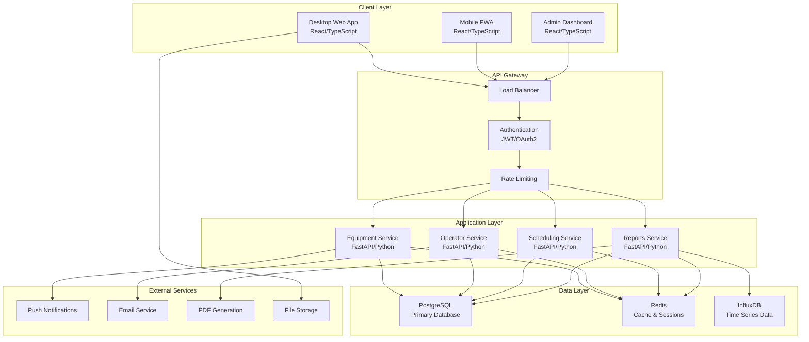
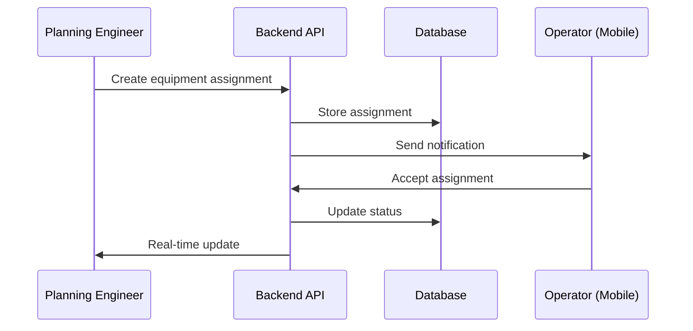
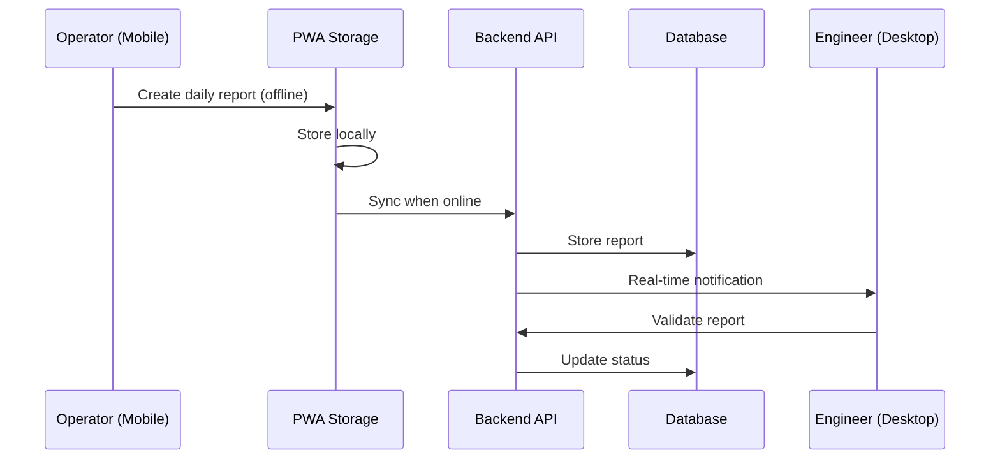
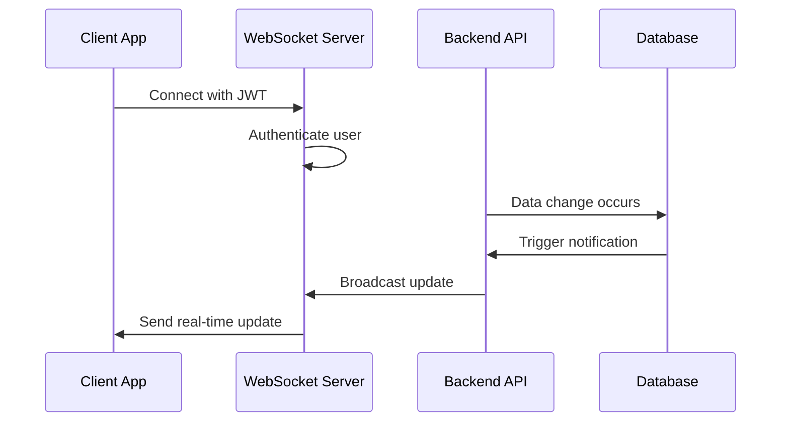

# System Architecture

## Overview

The Bitcorp ERP system follows a modern, scalable architecture designed for civil engineering equipment management. The system emphasizes real-time data flow, mobile-first design, and educational value through clear separation of concerns.

## Architecture Principles

### 1. Separation of Concerns
- **Frontend**: User interfaces and user experience
- **Backend**: Business logic and data processing
- **Database**: Data persistence and relationships
- **Mobile**: Field operations and offline capabilities

### 2. API-First Design
- RESTful APIs for standard operations
- GraphQL for complex queries
- WebSocket for real-time updates
- Clear versioning strategy

### 3. Mobile-First Approach
- Progressive Web App (PWA) for operators
- Offline-first data collection
- Responsive design for all screen sizes
- Touch-optimized interfaces

### 4. Scalability by Design
- Microservices-ready architecture
- Horizontal scaling capabilities
- Caching strategies at multiple levels
- Database optimization and indexing

## System Components

## Technology Stack

### Frontend Technologies

#### Web Application (Desktop)
- **Framework**: React 18 with TypeScript
- **State Management**: Zustand or Redux Toolkit
- **UI Library**: Material-UI (MUI) or Chakra UI
- **Routing**: React Router 6
- **HTTP Client**: Axios with interceptors
- **Forms**: React Hook Form with Zod validation
- **Charts**: Chart.js or Recharts
- **Build Tool**: Vite

#### Mobile Application (PWA)
- **Framework**: React 18 with TypeScript
- **PWA Tools**: Workbox for service workers
- **Offline Storage**: IndexedDB with Dexie.js
- **UI Components**: Mobile-optimized Material-UI
- **Camera Integration**: Browser APIs
- **GPS Integration**: Geolocation API
- **Push Notifications**: Web Push API

### Backend Technologies

#### API Layer
- **Framework**: FastAPI (Python 3.11+)
- **Database ORM**: SQLAlchemy 2.0 with async support
- **Migration Tool**: Alembic
- **Validation**: Pydantic v2
- **Authentication**: OAuth2 with JWT
- **API Documentation**: Automatic with FastAPI
- **Testing**: Pytest with async support

#### Background Tasks
- **Queue System**: Celery with Redis broker
- **Scheduling**: APScheduler for cron-like tasks
- **Distributed Computing**: Ray for complex scheduling algorithms

### Database Layer

#### Primary Database
- **Database**: PostgreSQL 15+
- **Features Used**:
  - JSONB for flexible data structures
  - Full-text search for equipment/operator search
  - Geometric types for location data
  - Row-level security for multi-tenancy
  - Partitioning for large tables

#### Caching & Sessions
- **Cache**: Redis 7+
- **Use Cases**:
  - Session storage
  - API response caching
  - Real-time data buffering
  - Rate limiting counters

#### Time Series Data
- **Database**: InfluxDB 2.0
- **Use Cases**:
  - Equipment usage metrics
  - Performance monitoring
  - Historical analytics
  - Trend analysis

### Infrastructure

#### Containerization
- **Container Runtime**: Docker
- **Orchestration**: Docker Compose (development), Kubernetes (production)
- **Base Images**: Official Python slim images
- **Multi-stage builds**: For optimized production images

#### CI/CD Pipeline
- **Version Control**: Git with GitHub
- **CI/CD**: GitHub Actions
- **Testing**: Automated test suites
- **Deployment**: Blue-green deployment strategy
- **Monitoring**: Health checks and metrics

## Data Flow Patterns

### 1. Equipment Management Flow

### 2. Daily Report Flow

### 3. Real-Time Updates Flow

## Security Architecture

### Authentication & Authorization
- **JWT Tokens**: Short-lived access tokens (15 minutes)
- **Refresh Tokens**: Long-lived refresh tokens (7 days)
- **Role-Based Access Control (RBAC)**: Granular permissions
- **Multi-Factor Authentication**: Optional 2FA for admin users
- **Session Management**: Redis-based session storage

### Data Protection
- **Encryption in Transit**: TLS 1.3 for all connections
- **Encryption at Rest**: Database-level encryption
- **Data Anonymization**: For analytics and reporting
- **Audit Logging**: Complete action trail
- **Input Validation**: Comprehensive validation at all layers

### API Security
- **Rate Limiting**: Per-user and per-endpoint limits
- **Request Validation**: Schema validation on all inputs
- **CORS Configuration**: Strict origin policies
- **Security Headers**: Comprehensive security headers
- **API Versioning**: Backward compatibility strategies

## Performance Considerations

### Database Optimization
- **Indexing Strategy**: Optimized indexes for common queries
- **Query Optimization**: Explain plan analysis and optimization
- **Connection Pooling**: Efficient database connections
- **Read Replicas**: For read-heavy operations
- **Partitioning**: For large historical data tables

### Caching Strategy
- **Application Cache**: In-memory caching for frequently accessed data
- **Database Query Cache**: Redis for complex query results
- **CDN**: For static assets and files
- **Browser Cache**: Optimized cache headers

### Frontend Performance
- **Code Splitting**: Lazy loading of routes and components
- **Bundle Optimization**: Tree shaking and minification
- **Image Optimization**: WebP format with fallbacks
- **Service Workers**: For offline capabilities and caching

## Scalability Roadmap

### Phase 1: Monolithic Deployment
- Single application server
- Single database instance
- Redis for caching
- Basic monitoring

### Phase 2: Horizontal Scaling
- Load-balanced application servers
- Database read replicas
- Distributed caching
- Advanced monitoring

### Phase 3: Microservices Architecture
- Service decomposition
- API gateway implementation
- Inter-service communication
- Service mesh for complex routing

### Phase 4: Cloud-Native Deployment
- Kubernetes orchestration
- Auto-scaling capabilities
- Multi-region deployment
- Disaster recovery implementation

## Monitoring & Observability

### Application Metrics
- **Response Times**: API endpoint performance
- **Error Rates**: Application and database errors
- **Throughput**: Requests per second
- **User Metrics**: Active users and feature usage

### Infrastructure Metrics
- **Resource Usage**: CPU, memory, disk usage
- **Database Performance**: Query performance and locks
- **Network Metrics**: Bandwidth and latency
- **Cache Performance**: Hit rates and memory usage

### Logging Strategy
- **Structured Logging**: JSON format for all logs
- **Log Aggregation**: Centralized log collection
- **Log Retention**: Appropriate retention policies
- **Alert Configuration**: Proactive issue detection

## Educational Value

This architecture is designed to teach:

1. **Modern Web Development**: Latest patterns and practices
2. **API Design**: RESTful and GraphQL best practices
3. **Database Design**: Relational and NoSQL patterns
4. **Mobile Development**: PWA and offline-first strategies
5. **DevOps Practices**: CI/CD, containerization, monitoring
6. **Security Implementation**: Authentication, authorization, encryption
7. **Performance Optimization**: Caching, indexing, scaling
8. **System Design**: Trade-offs and decision making

---

*This architecture provides a solid foundation for learning modern software development while building a production-ready ERP system.*
